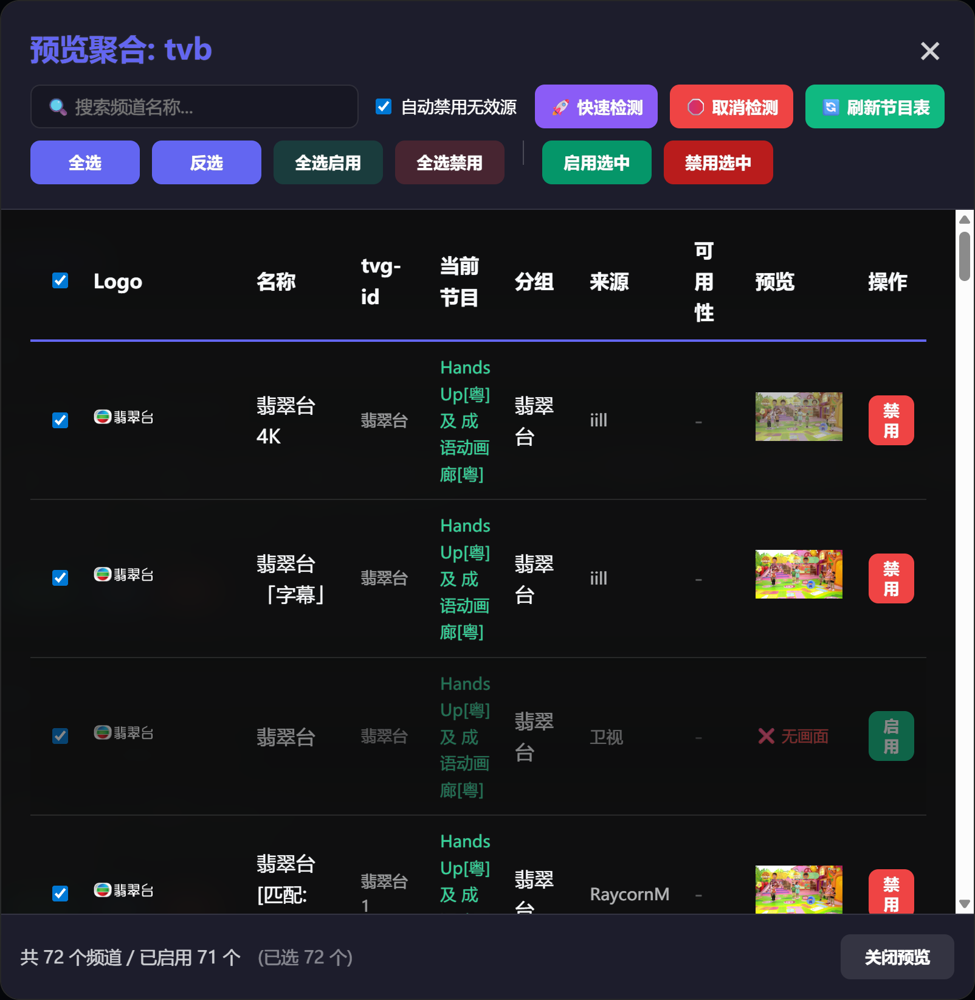

# IPTV M3U 管理器

一个简单的 IPTV M3U 订阅聚合与过滤工具，支持自定义频道提取和分组。

### 主要功能
- **聚合订阅**：支持添加多个 M3U 链接，甚至可以直接同步 Git 仓库中的 M3U 文件。
- **精细筛选**：通过关键字或正则表达式提取你想要的频道。
- **自定义分组**：支持将匹配到的频道重新划分为自定义的分组（如：央视、卫视、纪录片等）。
- **Logo、节目补全**：根据频道名称自动补全缺失的台标和节目。
- **自动更新**：支持设置定时任务自动更新订阅源。

### 演示截图


#### 频道有效性检测


### 运行指南

#### 方案一：Docker 启动（推荐，开箱即用）
1. **下载源码**：
   ```bash
   git clone https://github.com/XianYuDaXian/iptv-m3u-manager.git
   cd iptv-m3u-manager
   ```
2. **启动容器**：
   ```bash
   docker-compose up -d
   ```
3. **访问界面**：在浏览器打开 `http://localhost:8000`
> **注意**：所有数据（数据库、缓存）将持久化在当前目录下的 `data/` 文件夹中。

#### 方案二：本地手动运行
1. **下载源码**：
   ```bash
   git clone https://github.com/XianYuDaXian/iptv-m3u-manager.git
   cd iptv-m3u-manager
   ```
2. **安装依赖**：
   ```bash
   pip install -r requirements.txt
   ```
3. **启动程序**：
   ```bash
   uvicorn main:app --host 0.0.0.0 --port 8000 --reload
   ```
4. **访问界面**：
   - 本机访问：在浏览器打开 `http://localhost:8000`
   - 局域网访问：在浏览器打开 `http://<主机IP>:8000`

### 更新日志

- **2026-01-13**
    - 🐳 新增 Docker 支持，提供 `docker-compose` 一键部署方案。(因为要Ubuntu指定版本，所以构建时间稍长请耐心等待)
    - 🚀 优化 EPG 获取，缓解预览卡顿。
    - ✅ 聚合预览新增批量启用、禁用及全选功能。
    - 📺 新增深度检测，支持首帧截图并自动下线失效频道。
    - 🔗 支持 M3U/TXT/GitHub 格式混排及多地址同时输入。
- **2026-01-12**
    - 🎉 项目发布基础功能